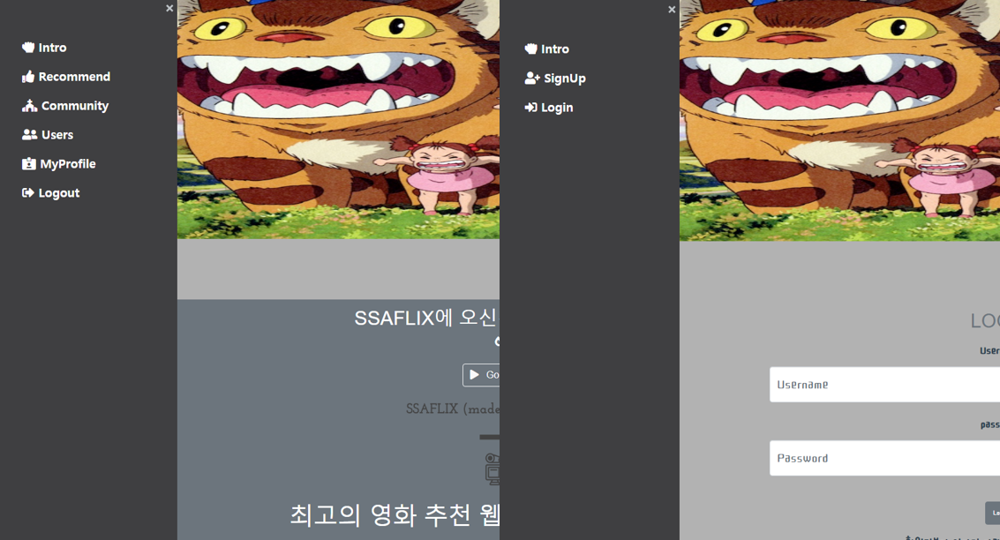
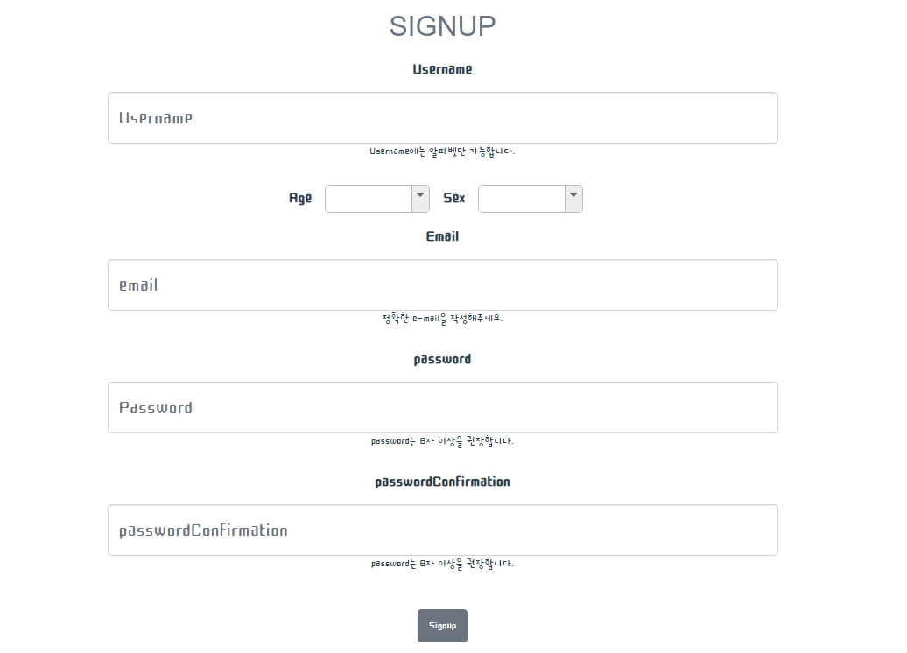
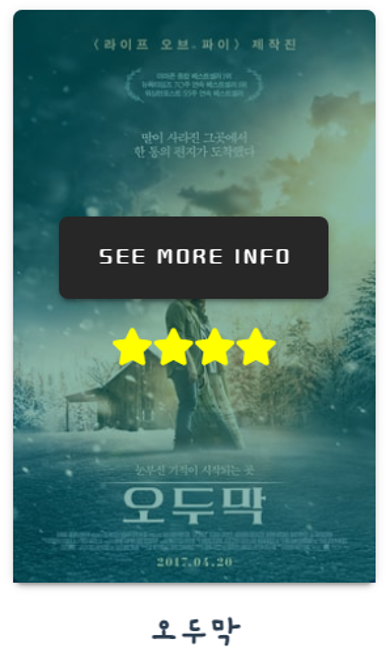
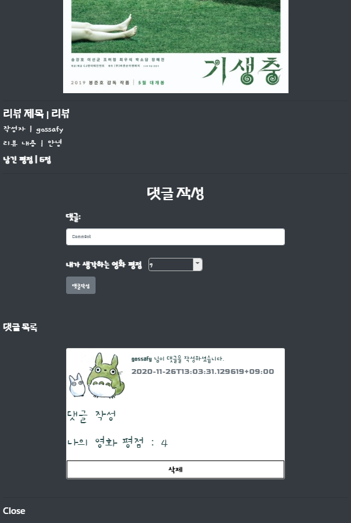
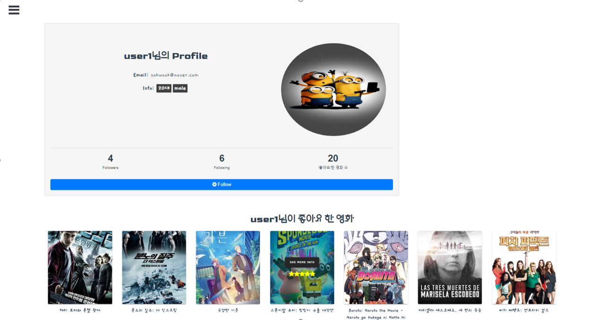
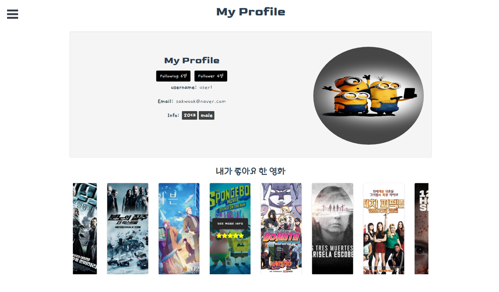
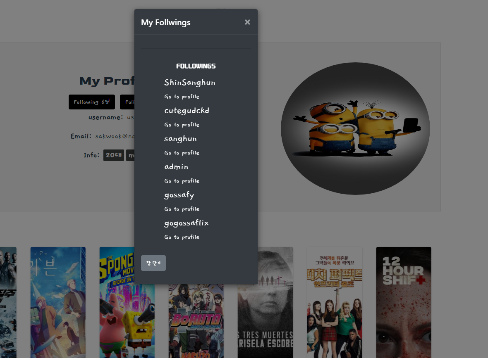
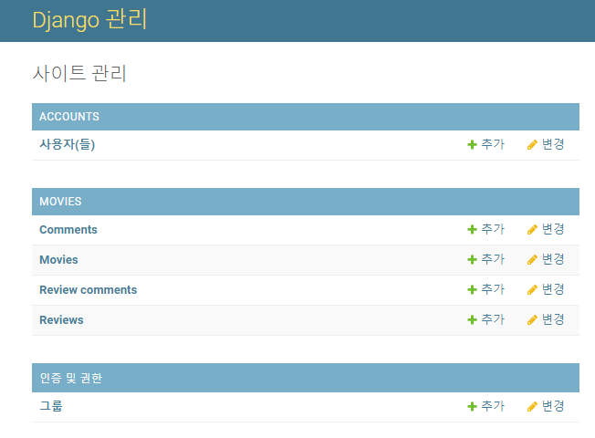

# SSAFLIX - 데이터 기반 영화 추천 웹 서비스


## 0. 개발 환경

Django 3.1.3

vue/cli 4.5.8


## 1. 팀원 정보

| 팀원 이름 | 업무 분담                                                    |
| --------- | ------------------------------------------------------------ |
| 신상훈    | 추천 알고리즘 작성 & Account 인증 기능 & Database 구축 & Follow, Like 기능 & CSS and Bootstrap |
| 이형창    | Django Modeling & Community 기능 구현 & 전체적인 Vue Front-end 디자인 주도 & CSS and Bootstrap |

- 모든 팀원이 모든 기능 및 업무에 관여


## 2. 프로젝트 구조 - Vue.js(Front-end) & DRF(Back-end)


## 2.1 Vue.js (Front-end)


### 2.1.1 초기 화면


초기 화면에서 SSAFLIX의 영화 추천 방식과 웹 서비스 기능 및 사용방법을 영상으로 설명하고 있다.

사교적인 분위기와 힐링 공간을 표방한다는 의미에서 지브리 애니메이션 디자인을 메인 디자인으로 활용했다.


### 2.1.2 Navbar




화면 왼쪽 상단 Navbar에서 로그인 상태에 따라

Intro(초기 화면), Recommend(영화 추천 페이지), Community(자유 게시판), Users(전체 유저 목록), MyProfile,  Logout, SignUp, Login 페이지로의 이동을 지원한다.


### 2.1.3 SignUp




회원가입은 username, age, sex, email 및 password 정보를 입력함으로 가능하다.


### 2.1.4 Login


Login 페이지에서, 회원가입을 하지 않은 사람을 SignUp 페이지로 유도한다.

로그인 된 회원은 JWT를 이용해 인증되게 된다.


### 2.1.5 Recommend


로그인을 완료하면, 사용자는 영화 추천 페이지로 자동 이동된다. 각 항목별로 glide 시스템을 이용해 추천받은 영화 목록을 넘기면서 확인할 수 있다.

영화 추천 방식은 다음과 같다.

1. 랜덤 영화 추천
   - 전체 영화에서 랜덤으로 30개의 영화를 추천한다.
2. 높은 평점 순 영화 추천
   - 전체 영화 중 평점이 가장 높은 영화 30개를 추천한다.
     - 초기 데이터로부터 각 영화는 **평균 평점(vote_average)**과 **투표 수(vote_count)**를 가지고 있고, SSAFLIX 회원이 평점과 함께 리뷰를 남기면 영화가 가지고 있는 평균 평점과 투표 수에 반영이 된다.
3. 상영 시간이 짧은 영화 추천
   - 가볍게 볼 수 있는 영화 30개를 추천하는 항목이다.
4. 최다 리뷰 순 추천
   - SSAFLIX 전체 회원이 리뷰한 영화 중, 리뷰 수가 가장 많은 30개 영화를 추천한다. 이 때 리뷰를 가진 영화가 30개 미만이라면 가장 먼저 리뷰된 영화와 같은 장르의 영화를 전체 데이터에서 가져와 부족한 수 만큼 추천한다.
     - 리뷰를 가진 영화가 하나도 없는 경우, 전체 데이터 중 **인기도(popularity)**가 가장 높은 30개 영화를 추천한다.
5. 내 좋아요 반영 추천
   - 내가 좋아요를 누른 영화에 좋아요를 누른 다른 회원들이 좋아요를 누른 모든 영화를 추천한다.
     - 내가 좋아요를 누른 영화가 없는 경우, 이 추천 항목은 보이지 않는다.


### 2.1.6 Movie Info



영화를 넘겨 보면서, 영화 포스터에 마우스를 가져다 대면 영화의 별점이 별의 갯수로 표시되고, 상세 정보를 확인할 수 있는 `SEE MORE INFO`버튼이 표시되도록 `vuetify` 의 `v-hover` 를 이용해 구현했다. 


포스터카드에 마우스를 가져대 나타나는 `MOVIE INFO` 버튼을 누르면, `modal` 형식의 영화 상세 정보 창이 나타난다.

영화 상세 정보 창에서는 영화 제목, 평점, 상영 시간, 개봉 일자, 영화 줄거리 및 좋아요 갯수를 확인할 수 있고, 비동기적 요청으로 해당 영화에 좋아요를 줄 수 있다.


### 2.1.7 Movie Review


영화 상세 정보 창에서 스크롤을 내리면, 해당 영화에 대한 리뷰를 작성할 수 있는 폼과 해당 영화에 대한 리뷰 리스트가 있다.

리뷰 작성은 리뷰 제목과 내가 생각하는 영화 평점, 리뷰 내용을 작성한다.

평점은 0점부터 10점까지 줄 수 있고, 이 때 부여되는 평점은 영화가 가진 평점 데이터에 반영된다.




리뷰 리스트 중 리뷰 하나의 제목을 클릭하면, 해당 리뷰 상세 정보 페이지 창이 새롭게 생성된다.

리뷰 상세 정보 페이지에는 해당 영화 제목, 포스터, 리뷰 제목, 작성자, 리뷰 내용 및 평점이 나타나고, 리뷰에 대한 댓글 작성 창을 같이 확인할 수 있다.

댓글 작성에는 내용과 댓글 작성자가 생각하는 영화 평점을 같이 기재하여 리뷰와 영화에 대한 의견을 주고 받을 수 있다.

리뷰 및 댓글은 작성자만 수정 및 삭제가 가능하다.


### 2.1.8 Community


Community(자유게시판) 에서 다른 회원들과 자유롭게 소통할 수 있다.

게시글 제목과 내용을 작성할 수 있고, 게시글 목록에는 글 번호, 게시글 제목 및 내용, 작성자가 표시된다.


게시글의 제목을 누르면 게시글 상세페이지로 이동한다. 상세페이지에는 작성자, 글 생성 및 수정시간, 내용이 나타나고, 댓글을 작성할 수 있다.

댓글 작성시 댓글 작성자의 프로필 사진을 가오나시로 귀엽게 설정해 보았다.


### 2.1.9 Users


전체 유저 목록을 확인할 수 있다.

유저 프로필에 마우스를 올리면 `hover`기능으로 유저 상세정보가 표시된다. 유저 이름, 이메일, 나이, 성별, 좋아요 한 영화 개수등이 표시된다. 페이스북, 트위터, 깃헙, 링크드 인으로 보내주는 링크도 있다.


### 2.1.10 User Profile




유저 프로필 페이지로 접속할 수 있다. Community, Community 댓글, Movie Review, Review 댓글 작성자의 아이디를 클릭하거나, 전체 유저 목록의 아이디를 클릭해 들어올 수 있다.

유저 프로필에는 해당 유저의 아이디, 이메일, 성별, 나이, 팔로우 및 팔로워 수, 유저가 좋아요를 누른 영화가 표시된다.

유저를 팔로우할 수 있다. 팔로우 버튼을 클릭하면 비동기적으로 버튼이 언팔로우 및 회색으로 변하게 되고, username을 팔로우 중입니다. 라는 메시지를 확인할 수 있다.

영화 추천 페이지에서와 같은 방식으로, 해당 유저가 좋아요를 누른 영화 목록을 확인하고, 상세 정보 및 리뷰 작성 창을 생성할 수 있다. 이러한 동작을 위해 영화 목록을 컴포넌트로 재사용했다.


### 2.1.11 My Profile



마이 프로필 탭을 이용해 내 프로필 페이지로 이동할 수 있다. 나의 팔로잉 & 팔로워 목록 및 수, username, 이메일과 나이, 성별을 확인할 수 있다. 또한 내가 좋아요 한 영화의 목록을 확인할 수있다.


영화 추천페이지와 다른 유저 프로필 페이지에서와 마찬가지로, 영화 리스트를 glide를 사용해 확인할 수 있으며 상세정보 페이지, 리뷰 등으로 접근이 가능하다.




`Following` 과 `Follower` 버튼을 누르면 위 사진처럼 나의 팔로우 목록과 팔로워 목록을 확인할 수 있다. 아이디 아래 있는 `Go to profile` 버튼을 통해 해당 유저의 프로필 페이지로 이동할 수 있다.


## 2.2 Django Rest Framework (Back-end)


### 2.2.1 기본 구조


SSAFLIX Back-end Django Frame Work의 구조는 다음과 같다.

유저에 관련된 `accounts` app 과 영화에 관련된 `movies` app 을 사용한다.


### 2.2.2 초기 영화 데이터 생성

- get_data.py

```python
import urllib.request
from pprint import pprint
import json

API_KEY = "f0851e398bd229f1eaa14b1a2fb840ce"
HOST = "https://api.themoviedb.org"
MOVIE_LIST_URI = "/3/movie/popular"
MOVIE_INFO_URI = "/3/movie/"
GENRE_LIST_URI = "/3/genre/movie/list"

movie_list = []
movie_Ids = []
genre_list = []

genre_request = (f'{HOST}{GENRE_LIST_URI}?api_key={API_KEY}&language=ko')
response = urllib.request.urlopen(genre_request)
json_str = response.read().decode('utf-8')
json_object = json.loads(json_str)

genre_data = json_object.get("genres")

for data in genre_data:

    my_data = {
        "number": data.get("id"),
        "name": data.get("name")
    }

    my_genre = {
        "model": "movies.genre",
        "pk": my_data.get("number"),
        "fields": {
            "name": my_data.get("name")
        },
    }
    genre_list.append(my_genre)

for i in range(1, 50):
    request = (f'{HOST}{MOVIE_LIST_URI}?api_key={API_KEY}&language=ko&page={i}')
    response = urllib.request.urlopen(request)
    json_str = response.read().decode('utf-8')
    json_object = json.loads(json_str)

    data_movies = (json_object.get("results"))

    for movie in data_movies:
        movie_Ids.append(movie.get("id"))

for idx, movie_Id in enumerate(movie_Ids):
    movie_request = (f'{HOST}{MOVIE_INFO_URI}{movie_Id}?api_key={API_KEY}&language=ko&')
    response = urllib.request.urlopen(movie_request)
    json_str = response.read().decode('utf-8')
    json_object = json.loads(json_str)
    if json_object.get("poster_path"):
        if json_object.get("genres"):

            my_object = {
                "model": "movies.movie",
                "pk": idx+1,
                "fields": {
                    "title": json_object.get("title"),
                    "adult": json_object.get("adult"),
                    "popularity": json_object.get("popularity"),
                    "poster_path": json_object.get("poster_path"),
                    "release_date": json_object.get("release_date"),
                    "runtime": json_object.get("runtime"),
                    "vote_average": json_object.get("vote_average"),
                    "vote_count": json_object.get("vote_count"),
                    "overview": json_object.get("overview"),
                    "genres": [json_object.get("genres")[0].get("id")],
                    "original_title": json_object.get("original_title"),
                }  
            }
        else:
            my_object = {
                "model": "movies.movie",
                "pk": idx+1,
                "fields": {
                    "title": json_object.get("title"),
                    "adult": json_object.get("adult"),
                    "popularity": json_object.get("popularity"),
                    "poster_path": json_object.get("poster_path"),
                    "release_date": json_object.get("release_date"),
                    "runtime": json_object.get("runtime"),
                    "vote_average": json_object.get("vote_average"),
                    "vote_count": json_object.get("vote_count"),
                    "overview": json_object.get("overview"),
                    "genres": json_object.get("genres"),
                    "original_title": json_object.get("original_title"),
                }
            }
        movie_list.append(my_object)

with open('movies.json', 'w', encoding='UTF-8') as file:
    file.write(json.dumps(movie_list, ensure_ascii=False))

with open('genres.json', 'w', encoding='UTF-8') as file:
    file.write(json.dumps(genre_list, ensure_ascii=False))
```

초기 영화 데이터를 얻기위해 tmdb API를 이용했다. 사용한 API 데이터는 tmdb의 인기 영화 목록 중 980개 영화를 사용했고, 장르 데이터도 가져왔다.

API 요청에 따른 응답을 json 데이터로 받아, object로 변환시키고 우리가 사용할 인자만 가져와 새로운 object로 만드는 코드를 작성했다. 사용하기로 한 정보는 다음과 같다.

영화 title, 성인영화 여부, 인기도, 포스터 이미지 url, 개봉일자, 상영시간, 평균 평점, 투표 수, 줄거리, 장르, 원제목 등을 가진 object로 변환했다.

변환된 object를 장르와 영화에 대해 각각 `genres.json`, `movies.json`으로 자동 dump하도록 코드를 작성해 사용했다.

모델링을 마친 후, dump 시킨 json 파일들을 loaddata 하여 사용했다.


### 2.2.3 Django modeling & ERD

- 전체 모델 관계 ERD


- accounts/models.py

```python
from django.db import models
from django.contrib.auth.models import AbstractUser

# Create your models here.
class User(AbstractUser):

    SEX_CHOICES = {
        ('male', 'Male'),
        ('female', 'Female'),
    }

    age = models.CharField(max_length=20)
    sex = models.CharField(max_length=10, choices=SEX_CHOICES, null=False, default="male")

    followers = models.ManyToManyField('self', symmetrical=False, related_name='followings')
```


- movies/models.py

```python
from django.db import models
from django.conf import settings
from django.core.validators import MaxValueValidator, MinValueValidator


class Genre(models.Model):
    name = models.TextField()


class Movie(models.Model):
    title = models.TextField()
    original_title = models.TextField()
    overview = models.TextField()
    genres = models.ManyToManyField(Genre)
    poster_path = models.TextField()
    vote_average = models.FloatField(validators=[MinValueValidator(0), MaxValueValidator(10)])
    vote_count = models.IntegerField(validators=[MinValueValidator(0)])
    release_date = models.TextField()
    runtime = models.IntegerField(validators=[MinValueValidator(0)])
    popularity = models.FloatField(validators=[MinValueValidator(0)])
    adult = models.BooleanField()
    like_users = models.ManyToManyField(settings.AUTH_USER_MODEL, related_name='like_movies')

    
class Community(models.Model):
  user = models.ForeignKey(settings.AUTH_USER_MODEL, on_delete=models.CASCADE, related_name="communities")
  title = models.CharField(max_length=100)
  content = models.TextField()
  created_at = models.DateTimeField(auto_now_add=True)
  updated_at = models.DateTimeField(auto_now=True)


class Comment(models.Model):
  user = models.ForeignKey(settings.AUTH_USER_MODEL, on_delete=models.CASCADE, related_name="comments")
  content = models.TextField()
  created_at = models.DateTimeField(auto_now_add=True)
  updated_at = models.DateTimeField(auto_now=True)
  community = models.ForeignKey(Community, on_delete=models.CASCADE)


class Review(models.Model):
  user = models.ForeignKey(settings.AUTH_USER_MODEL, on_delete=models.CASCADE, related_name="reviews")
  title = models.CharField(max_length=100)
  content = models.TextField()
  rank = models.IntegerField(validators=[MinValueValidator(0), MaxValueValidator(10)])
  movie = models.ForeignKey(Movie, on_delete=models.CASCADE)
  created_at = models.DateTimeField(auto_now_add=True)
  updated_at = models.DateTimeField(auto_now=True)


class ReviewComment(models.Model):
  user = models.ForeignKey(settings.AUTH_USER_MODEL, on_delete=models.CASCADE, related_name="review_comments")
  content = models.TextField()
  rank = models.IntegerField(validators=[MinValueValidator(0), MaxValueValidator(10)])
  created_at = models.DateTimeField(auto_now_add=True)
  updated_at = models.DateTimeField(auto_now=True)
  review = models.ForeignKey(Review, on_delete=models.CASCADE)
```

모델은 User, Movie, Genre, Community, Comment, Review, ReviewComment가 있다.

우선 Genre 는 Movie가 여러개를 가질 수 있는 동시에, 같은 Genre의 Movie도 여러개 존재할 수 있기 때문에 M:N 관계를 설정하였다.

Movie의 경우, User가 여러개의 영화에 좋아요를 누를 수 있고 한 영화에 여러 User역시 좋아요가 가능하므로 M:N 관계를 설정하였다.

특정 Movie에 대해 여러개의 Review 작성이 가능하므로 Review와는 1:N 관계이다.

Review의 경우 특정 User가 여러 Review를 작성할 수 있으므로 1:N 관계를 설정하였고, 한 Review에 여러개의 ReviewComment를 달 수 있으므로 1:N 관계를 설정하였다. 동시에 ReviewComment는 User와 1:N 관계가 된다.

Community 역시 마찬가지로 User와 1:N 관계이며 Comment와는 하나의 게시글에 여러개 Comment인 1:N관계이다. Comment는 한 유저가 여러개를 가질 수 있는 1:N관계이다.


### 2.2.4 settings.py

```python
INSTALLED_APPS = [
    'movies',
    'accounts',

    'django.contrib.admin',
    'django.contrib.auth',
    'django.contrib.contenttypes',
    'django.contrib.sessions',
    'django.contrib.messages',
    'django.contrib.staticfiles',

    'rest_framework', # DRF를 위한 rest_framework pip install 후 등록(공식문서 확인)
    'corsheaders', # (공식문서 참조함) # CORS를 위한 앱 등록.
]

MIDDLEWARE = [
    'corsheaders.middleware.CorsMiddleware', # CORS를 위한 Middleware 세팅(공식문서 참조)
    'django.middleware.security.SecurityMiddleware',
    'django.contrib.sessions.middleware.SessionMiddleware',
    'django.middleware.common.CommonMiddleware',
    'django.middleware.csrf.CsrfViewMiddleware',
    'django.contrib.auth.middleware.AuthenticationMiddleware',
    'django.contrib.messages.middleware.MessageMiddleware',
    'django.middleware.clickjacking.XFrameOptionsMiddleware',
]

# vue origin 허용
CORS_ALLOWED_ORIGINS = [
    'http://localhost:8080', # 특정 origin의 요청만 허용하는데, Vue의 로컬호스트만 요청을 허용.
]

JWT_AUTH = {
    'JWT_EXPIRATION_DELTA': datetime.timedelta(days=1),
}
```

DRF 사용을 위해 `rest_framework` 설치 및 등록을 해주었고, Vue.js를 이용해 렌더링 된 웹 페이지에서 교차 출처 리소스 공유를 위해 `corsheaders` 설치 및 등록을 해주었다. 동시에 `MIDDLEWARE` 세팅 및 vue origin url을 허용할 수 있도록 `CORS_ALLOWED_ORIGINS`를 설정하였다.

유저 인증은 jwt를 이용하였다. 토큰은 하루동안 지속할 수 있도록 재설정하였다.


### 2.2.7 accounts & movies  serializers.py

- accounts/serializers.py

  ```python
  from rest_framework import serializers
  from django.contrib.auth import get_user_model
  
  
  User = get_user_model()
  
  class UserSerializer(serializers.ModelSerializer):
  
      password = serializers.CharField(write_only=True)
      
      class Meta:
          model = User
          fields = ('id', 'username', 'like_movies', 'password', 'age', 'sex', 'email', 'followings', 'reviews', 'followers',)
          read_only_fields = ('followings', 'reviews', 'like_movies', 'followers',)
  ```

user정보를 응답으로 받아도 password는 알 수 없도록 password에 `write_only=True` 를 적용시켰다.

응답에서 유저의 팔로잉 목록, 작성 리뷰 목록, 좋아요한 영화 목록, 팔로워 목록등을 받을 수 있으면서도, 유저 등록시에는 작성할 필요가 없도록 `read_only_fields`에 추가하였다.


- movies/serializers.py

  ```python
  from rest_framework import serializers
  from .models import Movie, Community, Comment, Review, ReviewComment
  
  
  class CommunityListSerializer(serializers.ModelSerializer):
    userName = serializers.SerializerMethodField()
    
    def get_userName(self,obj):
      return obj.user.username
  
    class Meta:
      model = Community
      fields = ('id', 'userName', 'user', 'title', 'content', 'created_at', 'updated_at',)
      read_only_fields = ('user',)
  
  
  class CommentSerializer(serializers.ModelSerializer):
    userName = serializers.SerializerMethodField()
    
    def get_userName(self,obj):
      return obj.user.username
  
    class Meta:
      model = Comment
      fields = ('id', 'userName', 'user', 'content', 'created_at', 'updated_at', 'community',)
      read_only_fields = ('user','community',)
  
  
  class MovieSerializer(serializers.ModelSerializer):
  
      class Meta:
  
          model = Movie
          fields = '__all__'
          read_only_fields = ('like_movies', 'like_users',)
  
  
  class ReviewListSerializer(serializers.ModelSerializer):
    movie_title = serializers.SerializerMethodField()
  
    def get_movie_title(self, obj):
      return obj.movie.title
  
    userName = serializers.SerializerMethodField()
    
    def get_userName(self,obj):
      return obj.user.username
  
    class Meta:
      model = Review
      fields = ('id', 'user', 'userName', 'title', 'content', 'movie', 'rank', 'created_at', 'updated_at', 'movie_title')
      read_only_fields = ('user',)
  
  
  class ReviewCommentSerializer(serializers.ModelSerializer):
    userName = serializers.SerializerMethodField()
    
    def get_userName(self,obj):
      return obj.user.username
  
    class Meta:
      model = ReviewComment
      fields = ('id', 'userName', 'user', 'content', 'review', 'rank', 'created_at', 'updated_at',)
      read_only_fields = ('user', 'review',)
  ```

`SerializerMethodField()`를 사용해 Review와 Community, 댓글 등에서 작성자의 이름을 응답으로 바로 받아올 수 있도록 작성하였다.


### 2.2.6 accounts & movies view 함수

- accounts

  - urls.py

    ```python
    from django.urls import path
    from rest_framework_jwt.views import obtain_jwt_token
    from . import views
    
    
    urlpatterns = [
        path('users/', views.users),
        path('signup/', views.signup),
        path('api-token-auth/', obtain_jwt_token),
        path('myprofile/', views.my_profile),
        path('follow/<int:my_pk>/<int:user_pk>/', views.follow),
        path('info/', views.users_info),
        path('<username>/', views.profile),
    ]
    ```

  - views.py

    ```python
    @api_view(['POST'])
    def signup(request):
        password = request.data.get('password')
        passwordConfirmation = request.data.get('passwordConfirmation')
        if password != passwordConfirmation:
            return Response({ 'error': '비밀번호가 일치하지 않습니다.'})
    
        else:
            serializer = UserSerializer(data=request.data)
            if serializer.is_valid(raise_exception=True):
                user = serializer.save()
                user.set_password(request.data.get('password'))
                user.save()
                return Response(serializer.data)
    ```

    회원가입을 위한 로직이다. 비밀번호를 두 번 작성하도록 하여 비밀번호를 잘못 입력하는 경우를 방지하였고, 비밀번호 정보를 해싱하여 저장하였다.

    

    ```python
    @api_view(['POST'])
    @authentication_classes([JSONWebTokenAuthentication])
    @permission_classes([IsAuthenticated])
    def my_profile(request):
        user = get_object_or_404(get_user_model(), pk=request.data.get('user_id'))
        serializer = UserSerializer(user)
        return Response(serializer.data)
    ```

    다른 요청 없이 내 유저 정보를 불러와야하는 경우 사용하는 my_profile 함수이다. jwt에 저장되어있는 `user_id`를 이용한다.

    

    ```python
    @api_view(['POST'])
    @authentication_classes([JSONWebTokenAuthentication])
    @permission_classes([IsAuthenticated])
    def profile(request, username):
        user = get_object_or_404(get_user_model(), pk=request.data.get('user_pk'))
        serializer = UserSerializer(user)
        return Response(serializer.data)
    ```

    다른 유저의 프로필 페이지에서 해당 유저의 유저 정보를 불러오기 위해 사용하는 profile 함수이다. my_profile에서는 얻을 수 있는 정보가 jwt로부터 얻을 수 있는 user_id 뿐이었지만, 다른 유저 프로필의 경우 해당 username을 사용할 수 있으므로 요청과 응답에 걸리는 시간을 줄일 수 있다.

    

    ```python
    @api_view(['GET'])
    @authentication_classes([JSONWebTokenAuthentication])
    @permission_classes([IsAuthenticated])
    def users(request):
        users = get_user_model().objects.all()
        serializer = UserSerializer(users, many=True)
        return Response(serializer.data)
    ```

    전체 유저 목록을 불러오는 users함수이다. `GET` 요청을 받는다.

    

    ```python
    @api_view(['POST'])
    @authentication_classes([JSONWebTokenAuthentication])
    @permission_classes([IsAuthenticated])
    def follow(request, my_pk, user_pk):
        person = get_object_or_404(get_user_model(), pk=user_pk)
        me = get_object_or_404(get_user_model(), pk=my_pk)
        if person != me:
            if me.followings.filter(pk=person.pk).exists():
                me.followings.remove(person)
                following = False
            else:
                me.followings.add(person)
                following = True
            print(me.followings.filter(pk=person.pk))
            return Response(following)
    ```

    follow 함수이다. 상대와 나의 유저정보를 불러오고, `followings` table을 확인해 조작한다.

    

    ```python
    @api_view(['POST'])
    @authentication_classes([JSONWebTokenAuthentication])
    @permission_classes([IsAuthenticated])
    def users_info(request):
        users = request.data.get('users')
        movies = []
        for user in users:
            user = get_object_or_404(get_user_model(), pk=user)
            serializer = UserSerializer(user)
            like_movies = serializer.data.get('like_movies')
            for movie in like_movies:
                if movie not in movies:
                    movies.append(movie)
        return Response(movies)
    ```

    "내가 좋아요 누른 영화를 좋아요 누른 회원들이 좋아요 누른 영화 추천" 알고리즘에 사용되는 users_info 함수이다. 요청으로부터 받은 user들의 id 값을 이용해, `like_movies` table을 확인해 해당 user들의 모든 `like_movies_id`를 응답으로 보내준다.

    

- movies

  - urls.py

    ```python
    from django.urls import path
    from . import views
    
    urlpatterns = [
        path('', views.home),
    
        path('community_list_create/', views.community_list_create),
        path('detail/<int:community_pk>/', views.community_detail), 
        path('community/<int:community_pk>/', views.community_update_delete),
    
        path('comments/<int:community_pk>', views.comment_list),
        path('<int:community_pk>/comment/', views.create_comment),
        path('comment/<int:community_pk>/<int:comment_pk>/', views.comment_delete),
    
        
        path('<int:movie_pk>/review_list_create/', views.review_list_create),
        path('review/<int:review_pk>/', views.review_update_delete),
    
        path('review_comments/<int:review_pk>', views.review_comment_list),
        path('<int:review_pk>/review_comment/', views.create_review_comment),
        path('review_comment/<int:review_pk>/<int:review_comment_pk>/', views.review_comment_delete),
    
        path('recommend/', views.recommend),
        path('<int:my_pk>/<movie_title>/like/', views.movie_like),
        path('<int:my_pk>/like/', views.my_movie_like),
        path('<int:my_pk>/like/users/', views.like_movie_users),
    ]
    ```

  - views.py

    ```python
    @api_view(['GET'])
    def home(request):
        if request.method == 'GET':
            movies = Movie.objects.all()
            serializer = MovieSerializer(movies, many=True)
            return Response(serializer.data)
    ```

    모든 영화 정보를 받아오는 home 함수이다.

    


    ```python
    @api_view(['GET', 'POST'])
    @authentication_classes([JSONWebTokenAuthentication])
    @permission_classes([IsAuthenticated])
    def community_list_create(request):
      if request.method == 'GET':
        communities = Community.objects.all()
        serializer = CommunityListSerializer(communities, many=True)
        return Response(serializer.data)
      else:
        serializer = CommunityListSerializer(data=request.data)
        if serializer.is_valid(raise_exception=True):
          serializer.save(user=request.user)
          return Response(serializer.data, status=status.HTTP_201_CREATED)
    ```
    
    커뮤니티 정보를 불러오고, 글을 작성하는 community_list_create 함수이다.
    
    GET 요청 시 모든 커뮤니티 정보를 가져오고, POST 요청에서 글을 작성한다.


​    


    ```python
    @api_view(['GET'])
    @authentication_classes([JSONWebTokenAuthentication])
    @permission_classes([IsAuthenticated])
    def community_detail(request, community_pk):
      community = get_object_or_404(Community, pk=community_pk)
    
      serializer = CommunityListSerializer(community)
      return Response(serializer.data)
    ```
    
    커뮤니티 게시글의 상세 정보를 확인하는 community_detail 함수이다.


​    

    ```python
    @api_view(['GET'])
    @authentication_classes([JSONWebTokenAuthentication])
    @permission_classes([IsAuthenticated])
    def comment_list(request, community_pk):
        community = get_object_or_404(Community, pk=community_pk)
        comments = community.comment_set.all()
        serializer = CommentSerializer(comments, many=True)
        return Response(serializer.data)
    ```
    
    커뮤니티 특정 게시글의 모든 댓글을 조회하는 comment_list 함수이다.


​    

    ```python
    @api_view(['POST'])
    @authentication_classes([JSONWebTokenAuthentication])
    @permission_classes([IsAuthenticated])
    def create_comment(request, community_pk):
        community = get_object_or_404(Community, pk=community_pk)
        serializer = CommentSerializer(data=request.data)
        if serializer.is_valid(raise_exception=True):
    
            serializer.save(user=request.user, community=community)
    
            return Response(serializer.data, status=status.HTTP_201_CREATED)
    ```
    
    커뮤니티 특정 게시글에 댓글을 작성하는 create_comment함수이다.


​    

    ```python
    @api_view(['PUT', 'DELETE'])
    @authentication_classes([JSONWebTokenAuthentication])
    @permission_classes([IsAuthenticated])
    def community_update_delete(request, community_pk):
      community = get_object_or_404(Community, pk=community_pk)
    
      if not request.user.communities.filter(pk=community_pk).exists():
        return Response({'message': '권한이 없습니다.'})
    
      if request.method == 'PUT':
          serializer = CommunityListSerializer(community, data=request.data)
          if serializer.is_valid(raise_exception=True):
              serializer.save(user=request.user)
              return Response(serializer.data)
      else:
          community.delete()
          return Response({ 'id': community_pk })
    ```
    
    커뮤니티 글을 수정 및 삭제하는 community_update_delete 함수이다.


​    

    ```python
    @api_view(['DELETE'])
    @authentication_classes([JSONWebTokenAuthentication])
    @permission_classes([IsAuthenticated])
    def comment_delete(request, community_pk, comment_pk):
      community = get_object_or_404(Community, pk=community_pk)
      comment = community.comment_set.get(pk=comment_pk)
    
      if not request.user.comments.filter(pk=comment_pk).exists():
        return Response({'message': '권한이 없습니다.'})
      else:
        comment.delete()
        return Response({ 'id': comment_pk })
    ```
    
    커뮤니티 댓글을 삭제하는 comment_delete 함수이다.


​    

    ```python
    @api_view(['GET', 'POST'])
    @authentication_classes([JSONWebTokenAuthentication])
    @permission_classes([IsAuthenticated])
    def review_list_create(request, movie_pk):
      if request.method == 'GET':
        reviews = Review.objects.all().filter(movie_id=movie_pk)
        serializer = ReviewListSerializer(reviews, many=True)
        return Response(serializer.data)
      else:
        serializer = ReviewListSerializer(data=request.data)
        if serializer.is_valid(raise_exception=True):
          movie = get_object_or_404(Movie, pk=request.data.get('movie'))
    
          pre_point = movie.vote_average * movie.vote_count
          pre_count = movie.vote_count
    
          point = pre_point+request.data.get('rank')
          count = movie.vote_count + 1
          new_vote_average = round(point/count, 2)
    
          movie.vote_average = new_vote_average
          movie.vote_count = count
          movie.save()
            
          serializer.save(user=request.user)
          return Response(serializer.data, status=status.HTTP_201_CREATED)
    ```
    
    해당하는 영화에 대한 모든 리뷰를 조회하고, 리뷰를 작성하는 review_list_create 함수이다.
    
    특정 영화에 대한 리뷰를 조회하기 위해 `movie_pk`를 이용한다.
    
    리뷰 작성 시, 부여하는 평점을 영화 데이터에 반영하기 위해, 기존에 영화가 가지고 있던 `vote_average`와 `vote_count`를 이용해 기존 총 평점을 계산하고, 부여받은 평점을 더한뒤, `vote_count`를 1 증가시켜 그 값으로 나누어 평점을 변경한다.


​    

    ```python
    @api_view(['GET'])
    @authentication_classes([JSONWebTokenAuthentication])
    @permission_classes([IsAuthenticated])
    def review_comment_list(request, review_pk):
      review = get_object_or_404(Review, pk=review_pk)
      comments = review.reviewcomment_set.all()
      serializer = ReviewCommentSerializer(comments, many=True)
      return Response(serializer.data)
    ```
    
    특정 리뷰에 대한 모든 댓글을 조회하는 review_comment_list 함수이다.


​    

    ```python
    @api_view(['POST'])
    @authentication_classes([JSONWebTokenAuthentication])
    @permission_classes([IsAuthenticated])
    def create_review_comment(request, review_pk):
      review = get_object_or_404(Review, pk=review_pk)
      serializer = ReviewCommentSerializer(data=request.data)
      if serializer.is_valid(raise_exception=True):
        serializer.save(user=request.user, review=review)
        return Response(serializer.data, status=status.HTTP_201_CREATED)
    ```
    
    특정 리뷰에 댓글을 작성하는 create_review_comment 함수이다.


​    

    ```python
    @api_view(['PUT', 'DELETE'])
    @authentication_classes([JSONWebTokenAuthentication])
    @permission_classes([IsAuthenticated])
    def review_update_delete(request, review_pk):
      review = get_object_or_404(Review, pk=review_pk)
      if not request.user.reviews.filter(pk=review_pk).exists():
        return Response({'message': '권한이 없습니다.'})
    
      if request.method == 'PUT':
        serializer = ReviewListSerializer(review, data=request.data)
        
        if serializer.is_valid(raise_exception=True):
          movie = get_object_or_404(Movie, pk=request.data.get('movie'))
          pre_point = movie.vote_average * (movie.vote_count - 1)
          pre_count = movie.vote_count - 1
          point = pre_point+request.data.get('rank')
          count = movie.vote_count
          new_vote_average = round(point/count, 2)
          movie.vote_average = new_vote_average
          movie.vote_count = count
          movie.save()
          serializer.save(user=request.user)
          return Response(serializer.data)
    
      else:
        review = get_object_or_404(Review, pk=review_pk)
        movie = get_object_or_404(Movie, pk=review.movie_id)
        pre_point = movie.vote_average * (movie.vote_count)
        pre_count = movie.vote_count
        point = pre_point - review.rank
        count = movie.vote_count-1
        new_vote_average = round(point/count, 2)
        movie.vote_average = new_vote_average
        movie.vote_count = count
        movie.save()
        review.delete()
        return Response({ 'id': review_pk })
    ```
    
    특정 리뷰 수정 및 삭제하는 review_update_delete 함수이다. 리뷰의 수정 및 삭제 동작에서도 영화 평점을 변경해주어야하기 때문에, 알고리즘을 사용하였다.


​    

    ```python
    @api_view(['DELETE'])
    @authentication_classes([JSONWebTokenAuthentication])
    @permission_classes([IsAuthenticated])
    def review_comment_delete(request, review_pk, review_comment_pk):
      review = get_object_or_404(Review, pk=review_pk)
      comment = review.reviewcomment_set.get(pk=review_comment_pk)
      if not request.user.review_comments.filter(pk=review_comment_pk).exists():
        return Response({'message': '권한이 없습니다.'})
    
      else:
        comment.delete()
        return Response({ 'id': review_comment_pk })
    ```
    
    특정 리뷰 댓글을 삭제하는 review_comment_delete 함수이다.


​    

    - ↓↓ 영화 추천 알고리즘이 포함되어 있습니다. ↓↓
    
    ```python
    @api_view(['POST'])
    @authentication_classes([JSONWebTokenAuthentication])
    @permission_classes([IsAuthenticated])
    def recommend(request):
      favorite_movies = Movie.objects.all().order_by('-vote_average')[:30]
      serializer1 = MovieSerializer(favorite_movies, many=True)
      shortest_movies = Movie.objects.all().order_by('runtime')[30:60]
      serializer2 = MovieSerializer(shortest_movies, many=True)
      # 리뷰 기반 장르 추천
      users_movies = []
      # 좋아요 기반
      users_movies2 = []
      reviews = Review.objects.all()
      for review in reviews:
        movie = Movie.objects.get(pk=review.movie_id)
        if not movie in users_movies:
          users_movies.append(movie)
    
      if users_movies:
        serializer = MovieSerializer(users_movies[0])
        genre = serializer.data.get('genres')[0]
        genre_name = Genre.objects.get(id=genre)
        idx = 1
        while len(users_movies) < 30:
          movie = Movie.objects.get(pk=idx)
          ser = MovieSerializer(movie)
          if ser.data.get('genres')[0] == genre and movie not in users_movies:
            users_movies.append(movie)
          idx += 1
          if idx == 979:
            users_movies = Movie.objects.all().order_by('release_date')[:30]
      
      else:
        users_movies = Movie.objects.all().order_by('release_date')[:30]
    
      like_movies = request.data.get('like_movies')
      for like_movie in like_movies:
        movie = get_object_or_404(Movie, pk=like_movie)
        if not movie in users_movies2:
          users_movies2.append(movie)
    
      serializer3 = MovieSerializer(users_movies, many=True)
      serializer4 = MovieSerializer(users_movies2, many=True) 
      
      return Response([serializer1.data, serializer2.data, serializer3.data, serializer4.data])
    ```
    
    영화 추천 페이지에서 다양한 방식으로 영화를 추천해주는 recommend 함수이다.
    
    전체 영화 데이터를 사용해, 평점이 높은 순 30개 배열 , 상영시간이 짧은 순 30개 배열을 하나씩 생성한다.
    
    또한 리뷰 및 좋아요 기반 추천 영화를 담을 배열을 생성한다.
    
    - 리뷰 기반 추천 알고리즘
    
      전체 리뷰 데이터를 조회한 뒤, 리뷰가 가지고 있는 영화를 겹치지 않게 리뷰 기반 추천 배열에 넣는다. (30개까지) 30개를 채우지 못 했다면, 처음으로 담긴 영화의 장르 정보를 가져오고, 배열이 30개가 될 때까지 모든 영화 정보를 조회하며 겹치지 않는 장르가 같은 영화를 배열에 추가한다. 모든 데이터를 조회할 때까지 영화를 채우지 못했을 시, 개봉날짜가 최근인 영화를 추천한다.
    
    - 좋아요 기반 추천 알고리즘
    
      users_info 함수에서 내가 좋아요 누른 영화를 좋아요 누른 유저들이 좋아요를 누른 영화 id값을 받아왔다. id 값을 이용해 영화 데이터를 찾아 추천 배열에 담는다.
    
    만들어진 각 배열을 serialize하여 응답으로 보내준다.


​    

    ```python
    @api_view(['POST'])
    @authentication_classes([JSONWebTokenAuthentication])
    @permission_classes([IsAuthenticated])
    def movie_like(request, my_pk, movie_title):
      movie = get_object_or_404(Movie, title=movie_title)
      me = get_object_or_404(get_user_model(), pk=my_pk)
      if me.like_movies.filter(pk=movie.pk).exists():
          me.like_movies.remove(movie.pk)
          liking = False
          
      else:
          me.like_movies.add(movie.pk)
          liking = True
      
      return Response(liking)
    ```
    
    특정 영화에 좋아요를 하는 movie_like 함수이다.


​    

    ```python
    @api_view(['POST'])
    @authentication_classes([JSONWebTokenAuthentication])
    @permission_classes([IsAuthenticated])
    def my_movie_like(request, my_pk):
      me = get_object_or_404(get_user_model(), pk=my_pk)
      data = []
      movies = request.data
      for movie_pk in movies:
        movie = get_object_or_404(Movie, pk=movie_pk)
        serializer = MovieSerializer(movie)
        data.append(serializer.data)
      
      return Response(data)
    ```
    
    내가 좋아요 한 영화들을 보내주는 my_movie_like 함수이다.


​    

    ```python
    @api_view(['POST'])
    @authentication_classes([JSONWebTokenAuthentication])
    @permission_classes([IsAuthenticated])
    def like_movie_users(request, my_pk):
      users = []
      movies = request.data.get('movies')
      for movie in movies:
        movie = get_object_or_404(Movie, pk=movie)
        serializer = MovieSerializer(movie)
        for user in serializer.data.get('like_users'):
          if user not in users:
            users.append(user)
    
      return Response(users)
    ```
    
    특정 영화를 좋아요 한 유저들의 id 값을 받아오는 like_movie_users 함수이다. 이 함수로 얻은 값을 users_info 로 보내주어, 그 유저들이 좋아요를 누른 영화 id 값을 얻을 수 있다.

  


### 2.2.7 관리자 뷰



Django admin 기능을 이용해 관리자 뷰를 만들었다.

accounts/admin.py & movies/admin.py 에 명세서에서 요구하는 영화에 대한 권한과 유저 관리 권한외에도 게시글과 리뷰, 댓글에 대한 생성, 수정 및 삭제 권한을 가질 수 있도록  register했다.


## 3. 느낀점


### 3.1 신상훈

하나의 프로젝트를 성공적으로 완성시키는데 얼마나 많은 시간과 노력이 필요한지 배울 수 있었던 프로젝트였다. 완벽한 웹 서비스를 구현한 프로젝트라고 할 순 없겠지만 처음 생각했던 대부분의 기능과 알고리즘을 구현하였고, 처음 생각했던 수준보다 예쁘고 아기자기한 웹 사이트로 꾸밀 수 있었다.

일주일이 결코 긴 시간은 아니겠지만, 짧지 않은 시간동안 지속적으로 프로젝트를 진행하는 첫 경험이었기 때문에 팀원간의 역할 분담과 소통이 중요했다. 이 부분에서 소통은 매우 잘 이루어졌지만 팀장으로서 역할 분담을 하는 부분이 다소 어려웠다. 둘 모두 Back-end 나 Front-end 둘 중 하나에 치우치고 싶지 않았고, 각 역할 내에서도 잘하는 영역이 다르기 때문이었다. 결과적으로 둘 모두 Back과 Front 모두 참여하였다. 굳이 비율을 나누자면 내가 Back을, 이형창 팀원이 Front를 비교적 전담했다.

Git Lab에서 서로 컴포넌트 혹은 기능 단위로 브랜치를 만들어 작업 후, merge하는 형태의 작업방식을 선택했는데, 중간중간 merge에 오류가 생기거나 갑자기 local 파일이 이전 버전으로 돌아가는 이슈가 생겼다. 이러한 이슈를 수동 merge로만 해결할 수 있었기 때문에 시간적으로 손해를 많이 보았고 고된 작업이었다.

이번 프로젝트를 진행하면서 기존에 배운 모든 것을 활용하는 한편, Glide나 vuetify등 외부 기능들을 사용해 볼 기회를 가졌다. 끊임없이 새로운 기능들의 사용법을 숙지하며 프로젝트를 진행하는게 힘들기도 했지만 성장하는 느낌이라 더 열정적으로 임할 수 있었다.

시간의 부족을 많이 느꼈다. 특히, 영화 추천 페이지에서 많은 영화 데이터를 사용하고, 추천 알고리즘을 사용하기 위해 서버가 많은 계산을 해야해 페이지 렌더링 속도가 느렸다. lazyloading 기능을 구현하거나 알고리즘을 백트래킹할 수 있도록 개선이 필요했는데, 시간 부족으로 완료하지 못한 부분이 가장 아쉽다. 또한 제출할 영상 및 음성을 녹화, 녹음할 시간이 부족해 원테이크로 만들어 완성도가 떨어지고 음성 싱크가 맞지 않는 점이 아쉽다.

싸피 1학기 마지막 프로젝트를 마쳤다. 배운 것을 최대한 활용했기 때문에 복습도 되면서 내가 정말 많은 것을 할 수 있게 되었구나라는 소감이다. 이 경험을 바탕으로 2학기 프로젝트에 더 효율적인 개발자, 좋은 리더로서 활약해 보겠다.


### 3.2 이형창

결론적으로 데이터 기반 반응형 웹사이트를 아예 바닥부터 시작해 만들어 냈다는 생각에 매우 뿌듯한 프로젝트였다. 결과물을 보니 처음 예상했던 것보다 기능적으로나 디자인적으로나 더 괜찮게 결과물이 나와 기분이 좋았다.

나와 나의 팀원 상훈이 형 둘 다 프론트 앤드와 백앤드를 같이 작업했다. 굳이 나누자면 그 중 신상훈 팀원은 백엔드를 주도했고 나는 프론트앤드 부분을 주도했다고 할 수 있었다.

DRF(Django Rest Framework)와 Vue.js를 함께 사용해 DRF는 서버(백엔드)를, Vue는 웹페이지(프론트 엔드)역할로 각각의 프레임워크르 분담해 사용했는데, 중간중간 쉽지 않은 점이 많았다. 지금까지 배운 Django와 Vue의 기초적인 개념만을 활용해서는 페이지 구성에 한계가 있었기 때문에 웹페이지를 위한 니즈나, 오류가 생길 때마다 구글링과 교수님과의 질문을 통해 적극적으로 해결하려 했던 것 같다. 다행스럽고 뿌듯한 건 목표로 하는 기능이나 디자인은 문제가 생길 때 마다 대부분은 어떻게든 해결해 나갔던 것 같다. 

Vue의 DOM에서부터 시작해 어떠한 이벤트가 일어나거나 페이지가 최초 생성되면 Django 서버로 요청을 보내 Django 서버에서 각 사항에 알맞은 작업을 수행하고 다시 JSON 파일 형태로 응답을 보내면 이를 활용해 다시 Vue DOM에서 사용자가 보기 이쁘고 편하게 적절히 표현하는 과정을 모두 처음부터 끝까지 직접 작업 하다보니, 전체 흐름을 완벽히 파악할 수 있었고 또한 백엔드와 프론트앤드 코딩 실력도 프로젝트 전의 나보다 많이 향상된 것 같았다.

나 혼자였으면 시간 안에 절대 해낼 수 없는 프로젝트였지만, 신상훈 팀원과 함께여서 마지막까지 무사히 끝마칠 수 있었다 !

